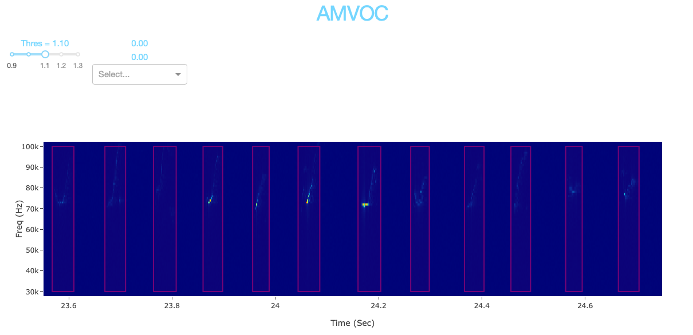
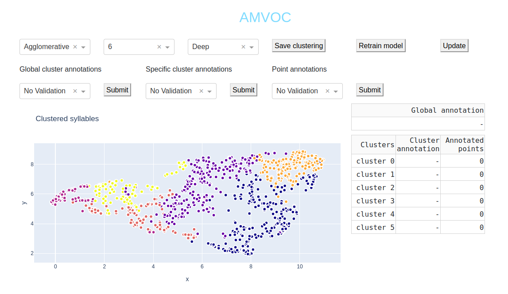

# amvoc: Python Tool for Analysis of Mouse Vocal Communication

## Intro
amvoc is a tool used to analyze mouse vocal communication through analyzing
 audio recordings from mouse communication signals.
 
## Setup
```
pip3 install -r requirements.txt
``` 


## Offline functionality
The main GUI for analyzing mouse sounds is in the `main.py`. 
It takes the WAV filename in which the recording to analyze is stored. 
By analyzing, we basically mean detecting the USVs (ultrasonic vocalizations) 
produced by the mouse, after processing the computed (or cached) spectrogram of 
the recording. Start and end time of each USV are saved in a .csv file named 
"offline_filename.csv". 
To just get the detected USVs, the user should run main.py as follows:

```
python3 main.py -i data/B148_test_small.wav -c n
```
Option -c declares whether the user would like to continue to the GUI, 
through the dash local address `http://127.0.0.1:8050/`. The purpose of the GUI 
is to visualize clusterings of the detected USVs of the recording. These
 clusterings are produced based on USVs' features, either 
 hand-crafted or derived from a deep convolutional autoencoder, 
 trained on a large number of USVs' spectrogram examples. 
 One can use the GUI to (a) inspect the spectrogram of the whole input signal, 
 (b) try various clustering parameters (clustering method, number of clusters, 
 type of features to be used), 
 (c) evaluate the clustering and (d) explore alternative clusterings 
 after re-training the autoencoder used for the feature extraction 
 through an active learning approach. 

One can run the `main.py` script as follow:

```
python3 main.py -i data/B148_test_small.wav -c y -s 1
```
if the user wants to use the GUI and also the spectrogram of the whole signal 
displayed (not recommended for long recordings). 
This functionality is set by parameter -s, which is optional.



### Clustering evaluation
For the clustering evaluation, three performance metrics have been employed: 
Global annotations (score 1-5 regarding the whole clustering), 
Cluster-specific annotations (score 1-5 regarding each separate cluster) 
and Point annotations (approve/reject choice for a specific USV in the 
cluster to which it has been assigned).
The assigned scores are saved in a .csv file named `annotations_eval_filename.csv`. 

### Semisupervised Representation of Mice Vocalizations

The user can intervene in the re-training of the autoencoder used for feature extraction (Deep) from USVs in order to explore new clustering alternatives, by imposing pairwise constraints between USVs. This is achieved by clicking on the "Retrain model" button on the GUI. Pairs of detected USVs will subsequently pop up and the user can declare whether or not they should belong to the same cluster by clicking "Yes" or "No" respectively, in the pop-up window. If they want to continue the retraining procedure without annotating more pairs, they can click on the "Stop" button, and if they want to completely interrupt the retraining, they can click on the "Cancel" button.

After the re-training procedure is finished, the user can inspect the new clustering by clicking on "Update" button. 

The option "Save clustering" gives the opportunity to save the cluster label of each USV, the autoencoder model used as "model_fileName_clusteringMethod_numClusters_featureType" and also train a classifier, saved as "clf_fileName_clusteringMethod_numClusters_featureType", using USV representations and their corresponding labels as ground-truth data. 



## Online functionality
AMVOC also includes an online functionality, i.e. the chance to detect USVs while recording the mouse vocal activity. This is achieved by running the main_live.py script, which detects USVs in online mode (every 750 ms) and saves their start and end times in a .csv file named "realtime_filename.csv". It just takes the WAV filename of the recording to be processed (or no filename 
if the signal is to be recorded from the soundcard).

```
python3 main_live.py -i data/B148_test_small.wav
```

Real-time classification of detected USVs is also provided, by using a classifier trained with clustering data (see above in `Vocalization Semisupervised Representation`) and the model used for feature extraction from this data. This can be done by first changing the "model" parameter in the config.json with the name of the new model and run main_live.py as:

```
python3 main_live.py -i data/B148_test_small.wav -c clf_B148_test_small_agg_6_deep

```
The name of the classifier in the line above is an example. 
  

## Vocalization detection evaluation and comparison
The detected vocalizations of a recording with our method 
can be compared to the detected vocalizations of the same recording using some other method, or to annotated vocalizations (ground truth). 
This comparison can be done using the `syllables_comp.py`, which takes the WAV filename of the recording, and the names of the two csv files to be compared.

```
python3 syllables_comp.py -i data/B148_test_small.wav -csv1 first_file.csv -csv2 second_file.csv
```
We have annotated some intervals of multiple recordings in order to evaluate 
the vocalization detection method and saved them in .csv files. 
These can be found in the folder data/vocalizations_evaluation, along with the corresponding WAV recordings. Ground truth files have the name gt_{num}.csv, for example gt_1.csv. We have also included the detected vocalizations from 5 other methods: 2 versions of MSA, MUPET, VocalMat and DeepSqueak. Their csv files, e.g. deepsqueak_1.csv can be used for comparison with our results or the ground truth annotations.

If one wants to reproduce the results, she can run the `main.py` 
(offline detection) or main_live.py (online detection):

```
python3 main.py -i data/vocalizations_evaluation/1/rec_1.wav -c n

```
or

```

python3 main_live.py -i data/vocalizations_evaluation/1/rec_1.wav

```

In order to compare the e.g. online detected vocalizations with the actual ones, 
the user should run the syllables_comp.py:

```
python3 syllables_comp.py -i data/vocalizations_evaluation/1/rec_1.wav -csv1 realtime_vocalizations.csv -csv2 data/vocalizations_evaluation/1/gt_1.csv
```

The evaluation metrics are displayed on terminal. 

